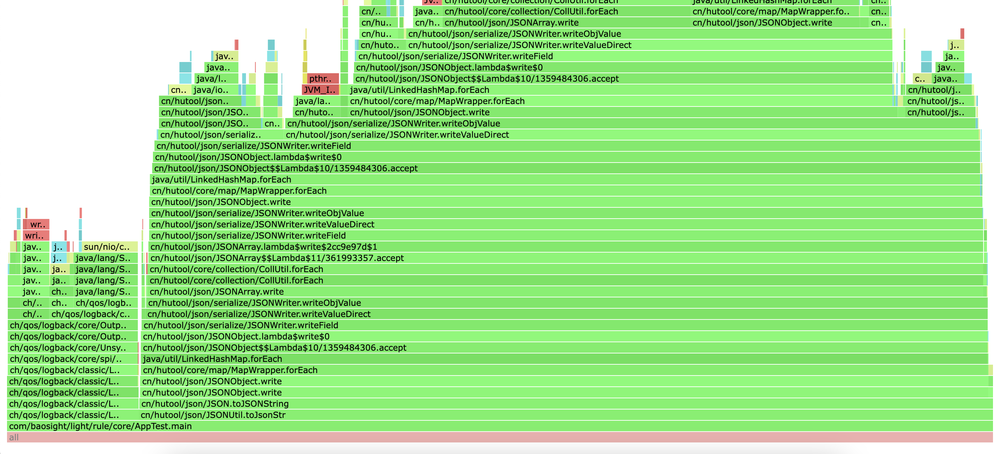

### 需求
最近碰到一个集合循环，程序执行偏慢的场景，需要进行排查。

### 代码案例
```java
    public static void main(String[] args) throws InterruptedException {
        String data = FileUtil.readString("/Users/test/Downloads/测试.json", Charset.defaultCharset());
        JSONObject bigObj = JSONUtil.parseObj(data);
        for (int i = 0; ; i++) {
            String dataStr = JSONUtil.toJsonStr(bigObj);
            log.info("dataStr:{}", dataStr);
        }
    }
```

### arthas处理
1、使用 arthas 的 profiler
> profiler start

等待程序执行，执行完之后生成火焰图

> profiler stop --format flamegraph




可以看到hutool 的 json 工具耗时是最长的，然后就可以排查业务逻辑慢的具体原因。

经过排查，hutool的json序列化比fastjson慢了很多，后续替换为fastjson